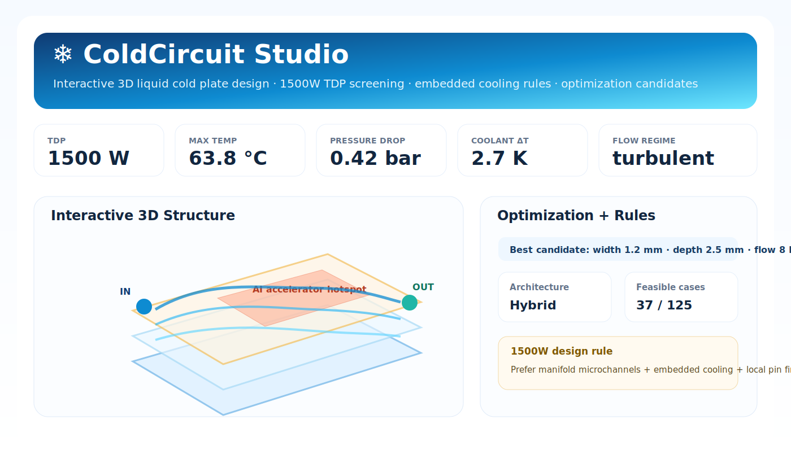
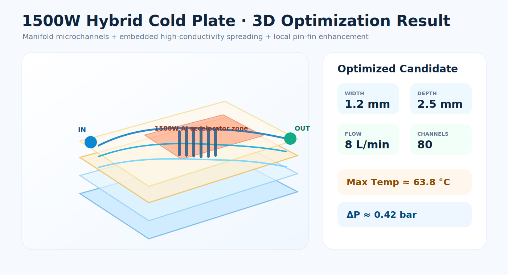

# ColdCircuit

**ColdCircuit** is an LLM-friendly liquid cold-plate thermal design library: a declarative, version-controlled, Python-native toolkit for creating, checking, simulating, optimizing, visualizing, and exporting early-stage liquid cold plate designs.

定位：**React / tscircuit for liquid cold plates**。

ColdCircuit is designed for workflows where a human engineer or an LLM generates a structured design specification, then the library validates it, runs a fast thermal-hydraulic screening model, checks manufacturability constraints, displays an interactive 3D front-end, and prepares downstream CAD / CFD / manufacturing artifacts.

> Current version: `0.3.0` engineering MVP.  
> Built-in simulation is for early design screening, not final CFD/qualification.

---

## Visual Preview

### Interactive Frontend Studio



### 1500W Hybrid 3D Optimization Result



### Conceptual Fluid Streamlines


---

## What ColdCircuit Does

ColdCircuit combines four layers:

1. **Declarative design layer**: LLMs or engineers define cold plates as Python objects or JSON.
2. **Fast screening layer**: simplified 1D thermal-hydraulic model for rapid design iteration.
3. **3D structure layer**: embedded cooling zones, layer stacks, ports, manifolds, local pin-fin regions, and heat-source footprints.
4. **Interactive visualization layer**: Streamlit + Plotly front-end with parameter sliders, 3D structure, streamlines, thermal map, optimization candidates, and grouped design rules.

---

## Features

### Implemented

- Declarative `ColdPlate` object model
- Pydantic v2 schema validation
- JSON specification support
- Core cold-plate components:
  - straight channel
  - serpentine channel
  - parallel microchannel bank
  - manifold
  - pin-fin array metadata
  - heat sources
  - inlet/outlet ports
- 3D structural metadata:
  - `ColdPlate3D`
  - `Layer3D`
  - `Port3D`
  - `EmbeddedRegion`
  - grouped `StructureFamily`
- Fast 1D thermal-hydraulic screening:
  - Reynolds number
  - hydraulic diameter
  - Nusselt number
  - heat-transfer coefficient
  - coolant temperature rise
  - pressure drop
  - estimated heat-source temperature
  - pass/fail against constraints
- Manufacturability checks:
  - minimum channel width
  - web thickness
  - aspect ratio
  - cover/roof thickness
  - port diameter
  - material notes for aluminum/copper/vehicle use
- 1500W TDP design support:
  - hybrid manifold microchannel reference design
  - embedded cooling stack
  - copper-spreading / local enhancement guidance
  - 1500W CLI generator
- Structure-grouped design rules:
  - serpentine
  - parallel microchannel
  - manifold microchannel
  - pin-fin
  - impingement
  - embedded
  - hybrid
- Optimization:
  - lightweight grid search
  - constraint filtering
  - objective ranking
  - interactive optimization preview in front-end
- Optional backend stubs:
  - build123d/CadQuery CAD adapter
  - OpenFOAM case generator
- CLI:
  - validate
  - simulate
  - report
  - optimize
  - schema
  - openfoam
  - rules
  - tdp1500
- Interactive frontend:
  - parameter sliders
  - 3D layered cold-plate view
  - conceptual fluid streamlines
  - estimated temperature map
  - optimization candidate table
  - structure-family design cards
  - JSON inspection panel

### Planned

- production STEP generation through build123d
- robust channel boolean subtraction
- OpenFOAM meshing templates
- conjugate heat-transfer CFD
- response-surface / surrogate optimization
- LLM tool-call playground
- validated empirical correlations for specific cold-plate families

---

## Install

```bash
pip install -e .
```

Development install:

```bash
pip install -e ".[dev]"
```

Frontend install:

```bash
pip install -e ".[frontend]"
```

All optional dependencies:

```bash
pip install -e ".[all]"
```

---

## Launch the Interactive Frontend

```bash
streamlit run frontend/streamlit_app.py
```

The front-end supports:

- loading the built-in 1500W reference design;
- loading example JSON designs;
- uploading a custom ColdCircuit JSON;
- interactively changing flow rate, channel width, channel depth, and pitch;
- visualizing the 3D layer stack;
- viewing conceptual fluid streamlines;
- viewing a generated thermal map;
- running a bounded optimization preview;
- browsing structure-grouped embedded cooling rules.

---

## Quick Start

```python
from coldcircuit import (
    ColdPlate, Material, Fluid, InletOutlet,
    SerpentineChannel, HeatSource
)

plate = ColdPlate(
    name="serpentine_250w_demo",
    base_size_mm=(100, 80),
    thickness_mm=8,
    material=Material.aluminum_6061(),
    fluid=Fluid.water(),
    inlet_outlet=InletOutlet(
        inlet_xy_mm=(8, 8),
        outlet_xy_mm=(92, 72),
        port_diameter_mm=6,
        flow_rate_lpm=1.5,
        max_pressure_drop_bar=0.5,
    ),
    channels=[
        SerpentineChannel(
            width_mm=2.0,
            depth_mm=1.5,
            pass_count=8,
            pitch_mm=6.0,
            margin_mm=8.0,
        )
    ],
    heat_sources=[
        HeatSource(
            name="250W chip",
            center_xy_mm=(50, 40),
            size_mm=(25, 25),
            power_w=250,
            max_temperature_c=55,
        )
    ],
    manufacturing_process="cnc_brazed",
)

result = plate.simulate_1d(coolant_inlet_c=25)
print(result.model_dump_json(indent=2))
```

---

## 1500W TDP Reference Design

Generate the reference design and 3D stack:

```bash
coldcircuit tdp1500
```

Run the built-in 1500W example:

```bash
coldcircuit simulate examples/tdp1500_hybrid_reference.json
coldcircuit report examples/tdp1500_hybrid_reference.json --out tdp1500_report.md
coldcircuit optimize examples/tdp1500_hybrid_reference.json --out optimization.json
```

The reference design uses a **hybrid manifold microchannel architecture**:

- 1500 W heat source;
- 180 × 120 × 10 mm cold plate envelope;
- copper-equivalent high-conductivity base;
- 80 parallel microchannels;
- local pin-fin metadata;
- dual-side manifold concept;
- embedded high-conductivity spreading zone;
- 8 L/min baseline flow rate.

This reference design is an optimization starting point, not a final product design.

---

## CLI

```bash
coldcircuit validate examples/serpentine_250w.json
coldcircuit simulate examples/serpentine_250w.json
coldcircuit report examples/serpentine_250w.json --out report.md
coldcircuit optimize examples/serpentine_250w.json --out optimization.json
coldcircuit schema --out coldcircuit_schema.json
coldcircuit openfoam examples/serpentine_250w.json --case-dir openfoam_case
coldcircuit rules --out structure_rules.json
coldcircuit tdp1500
```

---

## Structure Families

ColdCircuit organizes design rules by cold-plate structure family:

| Family | Typical use | Key risk |
|---|---|---|
| `serpentine` | compact prototype, moderate TDP | long path pressure drop and downstream warming |
| `parallel_microchannel` | high heat-transfer area | flow maldistribution and clogging |
| `manifold_microchannel` | 1000–1500W class designs | manifold balancing and CFD validation |
| `pin_fin` | local hotspot enhancement | pressure drop and manufacturability |
| `impingement` | concentrated heat-flux zones | local gradients and return-flow design |
| `embedded` | near-junction cooling | roof strength, leakage, alignment tolerance |
| `hybrid` | high-density AI/GPU cold plates | coupled manufacturing and validation complexity |

---

## LLM Usage Pattern

Recommended approach:

1. Ask the LLM to output **only JSON** following the ColdCircuit schema.
2. Validate the JSON with `coldcircuit validate`.
3. Run `simulate`.
4. Ask the LLM to revise only failed variables.
5. Run `optimize` for bounded design variables.
6. Review results in the Streamlit front-end.
7. Export CAD/CFD artifacts for engineering review.

Example prompt:

```text
Output a ColdCircuit JSON only.

Design a 180 × 120 × 10 mm liquid cold plate for a 1500 W AI accelerator.
Use a hybrid manifold microchannel + embedded cooling structure.
Use water coolant, 8 L/min baseline flow, local pin-fin enhancement, and dual-side manifolds.
Keep pressure drop below 1.2 bar and maximum source temperature below 75°C.
```

---

## Engineering Warning

This library is intentionally conservative and simplified. Before product release, validate by:

- detailed CFD;
- structural pressure analysis;
- leak testing;
- thermal cycling;
- vibration/shock testing;
- corrosion / coolant compatibility testing;
- manufacturing process qualification;
- inspection and traceability plan.
